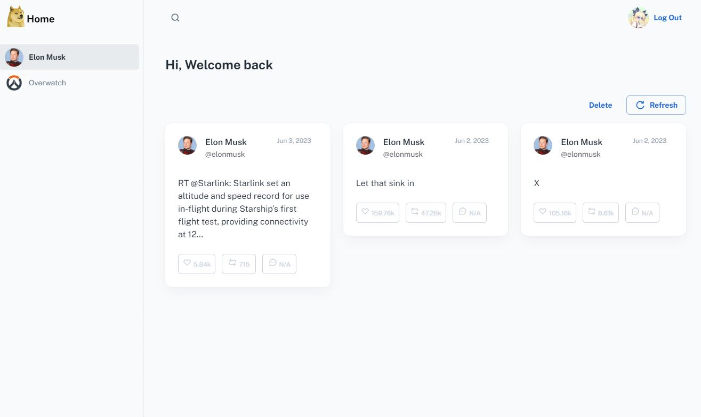

## Twitter Dashboard


> Built using https://material-ui.com/store/items/minimal-dashboard/.

## Description

Your own twitter dashboard with a grid view and optimized for blazing-fast interactions (like, retweet, comment).
Add your favorite twitter accounts and see which tweets you have interacted with in a glance!



## Getting started

- Recommended `node js 16.x` and `npm 6+`. (suggestion v16.15.0)
- Install dependencies: `npm install` / `yarn install`
- Start the project: `npm start` / `yarn start`

## Environment variables
To put in .env file

```Python
# The URL of the backend API
REACT_APP_API=http://localhost:5000 
```

## License

Distributed under the MIT License. See [LICENSE](https://github.com/minimal-ui-kit/minimal.free/blob/main/LICENSE.md) for more information.

